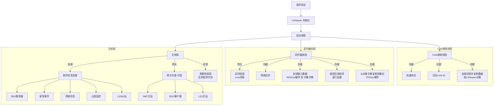

CANopenNode 是一个开源的 CANopen 协议栈。
# 克隆demo仓库

要开始学习如何使用CANopenNode，可以先克隆 demo 仓库：
```bash
git clone https://github.com/CANopenNode/CANopenDemo.git
cd CANopenDemo
git submodule update --init --recursive

```

# CANopen architecture



# tutorial

看到如此庞大的仓库可能会让人感到困惑，让我们从教程开始：
- [tutorial](tutorial/tutorial.md)
