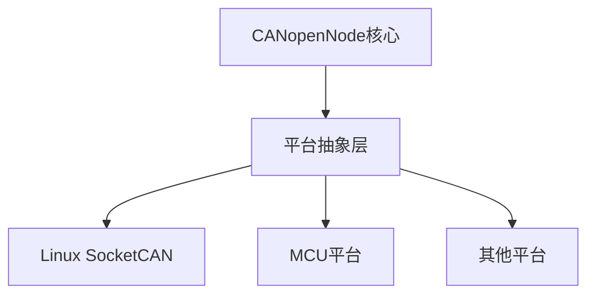

# 原型
```c
CO_ReturnError_t CO_CANmodule_init(
    CO_CANmodule_t* CANmodule,        // CAN模块实例
    void* CANptr,                      // CAN配置信息
    CO_CANrx_t rxArray[],             // 接收缓冲区数组
    uint16_t rxSize,                   // 接收缓冲区大小
    CO_CANtx_t txArray[],             // 发送缓冲区数组
    uint16_t txSize,                   // 发送缓冲区大小
    uint16_t CANbitRate                // CAN波特率
)
```

`CANptr`使用`void*` 类型，可以指向任何类型的CAN配置信息。
在Linux中
```c
CO_CANptrSocketCan_t* CANptrReal = (CO_CANptrSocketCan_t*)CANptr;
```
为什么这样设计

