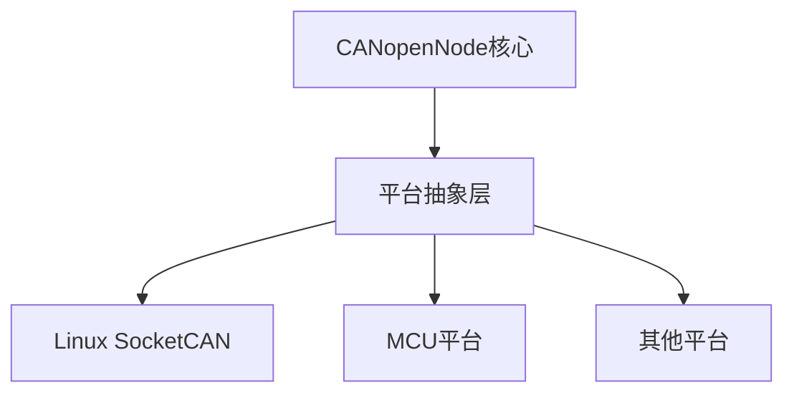

# 原型
```c
CO_ReturnError_t CO_CANmodule_init(
    CO_CANmodule_t* CANmodule,        // CAN模块实例
    void* CANptr,                      // CAN配置信息
    CO_CANrx_t rxArray[],             // 接收缓冲区数组
    uint16_t rxSize,                   // 接收缓冲区大小
    CO_CANtx_t txArray[],             // 发送缓冲区数组
    uint16_t txSize,                   // 发送缓冲区大小
    uint16_t CANbitRate                // CAN波特率
)
```

`CO_CANmodule_init`函数初始化CAN模块， 并创建接收和发送缓冲区等。

`CANptr`使用`void*` 类型，可以指向任何类型的CAN配置信息。

在Linux中强转为`CO_CANptrSocketCan_t`类型
```c
CO_CANptrSocketCan_t* CANptrReal = (CO_CANptrSocketCan_t*)CANptr;
```
为什么这样设计

`CO_CANptrSocketCan_t`结构体定义如下
```c
typedef struct {
    int epoll_fd;
    int can_ifindex;
} CO_CANptrSocketCan_t;

```
可以看出`CO_CANptrSocketCan_t`结构体中包含`epoll_fd`和`can_ifindex`两个成员。
也就是我们通信的时候需要
`epoll_fd` epoll的文件描述符
`can_ifindex` CAN接口的索引。


