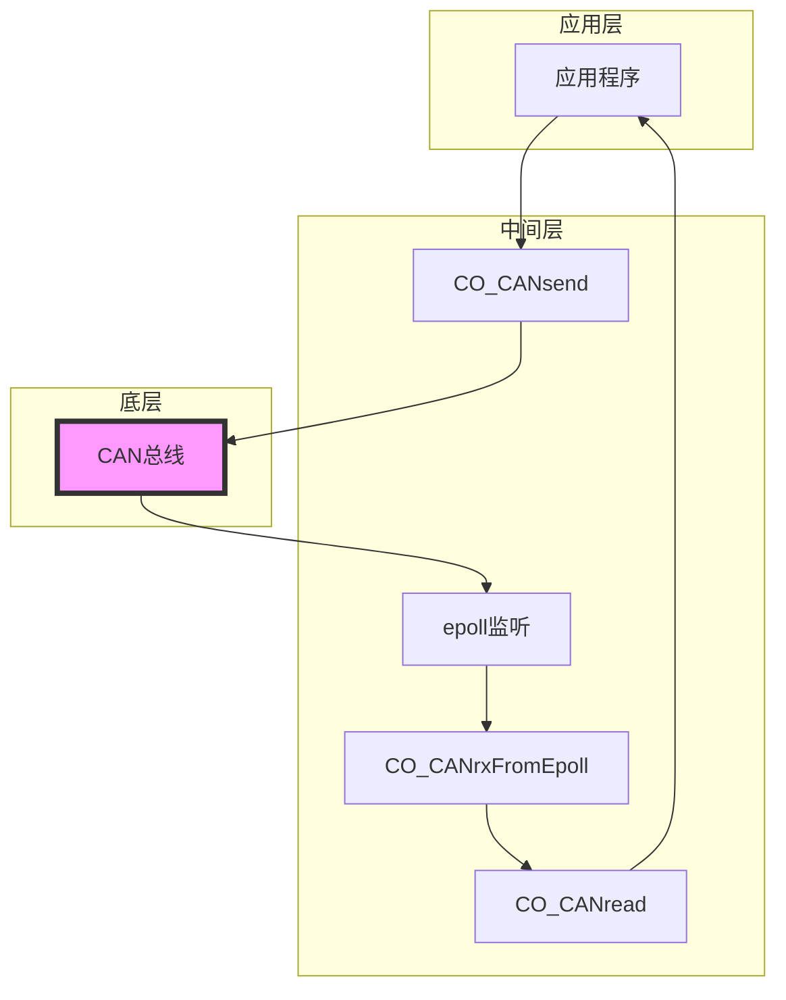
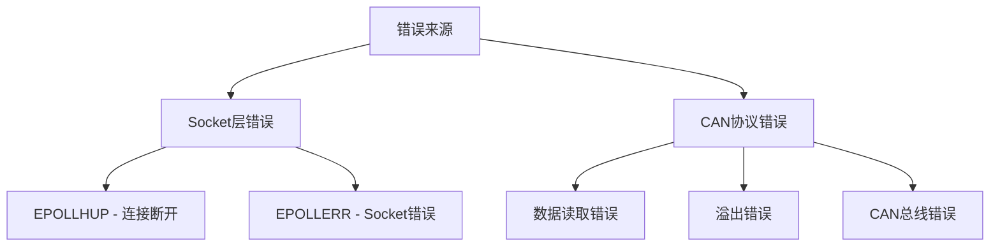

# dif with CO_CANsend

与`CO_CANsend`不同， `CO_CANread`是一个被动操作， 由`epoll`监听到CAN口的事件， 进行处理后交由`CO_CANread`处理。


# recv & recvmsg

`CO_CANread`使用`recvmsg`接收而非`recv`

```c
// 1. recv - 最基础的接收函数
ssize_t recv(int sockfd, void *buf, size_t len, int flags);

// 2. recvmsg - 高级接收函数，可以获取更多控制信息
ssize_t recvmsg(int sockfd, struct msghdr *msg, int flags);

struct msghdr {
    void         *msg_name;       // 可选地址
    socklen_t     msg_namelen;    // 地址长度
    struct iovec *msg_iov;        // I/O 缓冲区数组
    size_t        msg_iovlen;     // 缓冲区数量
    void         *msg_control;    // 辅助数据
    socklen_t     msg_controllen; // 辅助数据长度
    int           msg_flags;      // 接收标志
};
```

错误类型的层级



实际例子

```c
// 例如一个完整的读取过程可能遇到的错误：

// 1. Socket层错误（使用recv处理）
if (EPOLLHUP) {
    // CAN接口可能物理断开
    recv(...);  // 清除错误状态
}

// 2. 数据读取时的错误（使用recvmsg检测）
CO_CANread(...) {
    // a. 读取长度错误
    if (n != CAN_MTU) {
        return CO_ERROR_SYSCALL;
    }
    
    // b. 接收队列溢出
    if (cmsg->cmsg_type == SO_RXQ_OVFL) {
        return CO_ERROR_RX_OVERFLOW;
    }
    
    // c. CAN错误
    if (msg.can_id & CAN_ERR_FLAG) {
        // 处理CAN总线错误
    }
}
```
