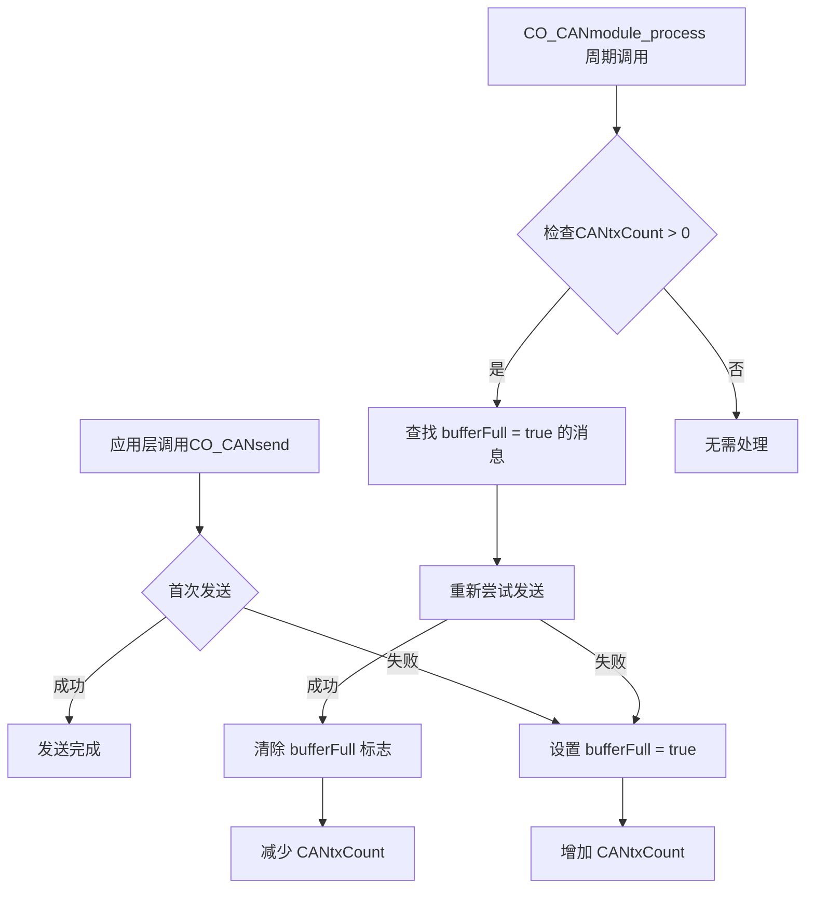

```mermaid
graph TD
    A[应用层调用CO_CANsend] --> B{首次发送}
    B -->|成功| C[发送完成]
    B -->|失败| D[设置 bufferFull = true]
    D --> E[增加 CANtxCount]
    
    F[CO_CANmodule_process 周期调用] --> G{检查CANtxCount > 0}
    G -->|是| H[查找 bufferFull = true 的消息]
    G -->|否| I[无需处理]
    H --> J[重新尝试发送]
    J -->|成功| K[清除 bufferFull 标志]
    J -->|失败| D
    K --> L[减少 CANtxCount]
```

