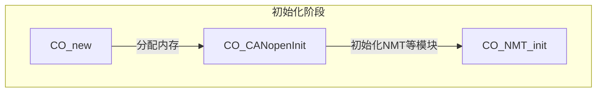
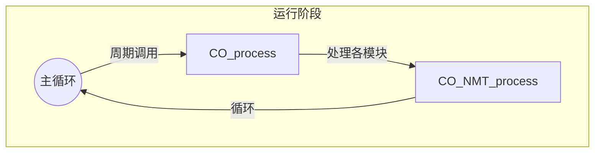

NMT的初始化和运行都由系统自动处理了。

- `CO_CANopenInit` 会调用 `CO_NMT_init` 初始化NMT模块。
- `CO_process` 会调用 `CO_NMT_process` 处理NMT模块。

# NMT 初始化
---



# 运行阶段
---


basically it's like.

```c
// 1. 框架帮我们完成初始化
CO_new(...);
CO_CANopenInit(...);  // 内部调用 CO_NMT_init

// 2. 框架帮我们处理基本流程
while(1) {
    CO_process(...);  // 内部调用 CO_NMT_process
}
```

# 状态控制
---

## 核心状态
```c
typedef enum {
    CO_NMT_UNKNOWN = -1,          /**< -1, 设备状态未知 (用于心跳接收者) */
    CO_NMT_INITIALIZING = 0,      /**< 0, 初始化中 */
    CO_NMT_PRE_OPERATIONAL = 127, /**< 127, 预运行：可配置，不能传输数据 */
    CO_NMT_OPERATIONAL = 5,       /**< 5, 运行：正常工作状态 */
    CO_NMT_STOPPED = 4           /**< 4, 停止：只响应NMT命令 */
} CO_NMT_internalState_t;
```
基本命令 - 用于控制节点状态

```c
typedef enum {
    CO_NMT_ENTER_OPERATIONAL = 1,    // 进入运行
    CO_NMT_ENTER_STOPPED = 2,        // 进入停止
    CO_NMT_ENTER_PRE_OPERATIONAL = 128, // 进入预运行
    CO_NMT_RESET_NODE = 129,         // 重置节点
    CO_NMT_RESET_COMMUNICATION = 130  // 重置通信
} CO_NMT_command_t;
```
心跳功能
```c
// 在CO_NMT_t中
uint32_t HBproducerTime_us;    // 心跳周期
uint32_t HBproducerTimer;      // 心跳定时器
```

可以调用`CO_NMT_sendInternalCommand`主动改变状态
```c
CO_NMT_sendInternalCommand(NMT, CO_NMT_ENTER_OPERATIONAL);

// - 监控状态
if(state == CO_NMT_OPERATIONAL) {
    // 做一些事情
}
```

