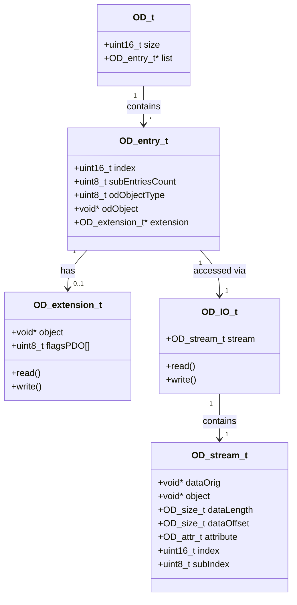

```mermaid
classDiagram
    class OD_t {
        +uint16_t size
        +OD_entry_t* list
    }

    class OD_entry_t {
        +uint16_t index
        +uint8_t subEntriesCount
        +uint8_t odObjectType
        +void* odObject
        +OD_extension_t* extension
    }

    class OD_extension_t {
        +void* object
        +read()
        +write()
        +uint8_t flagsPDO[]
    }

    class OD_IO_t {
        +OD_stream_t stream
        +read()
        +write()
    }

    class OD_stream_t {
        +void* dataOrig
        +void* object
        +OD_size_t dataLength
        +OD_size_t dataOffset
        +OD_attr_t attribute
        +uint16_t index
        +uint8_t subIndex
    }

    OD_t "1" --> "*" OD_entry_t : contains
    OD_entry_t "1" --> "0..1" OD_extension_t : has
    OD_entry_t "1" --> "1" OD_IO_t : accessed via
    OD_IO_t "1" --> "1" OD_stream_t : contains

```