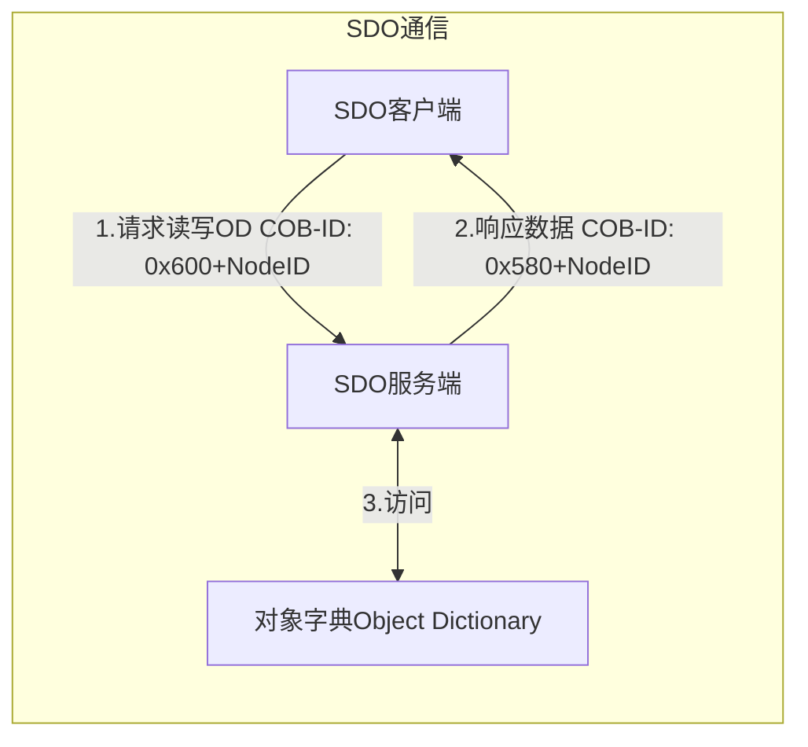
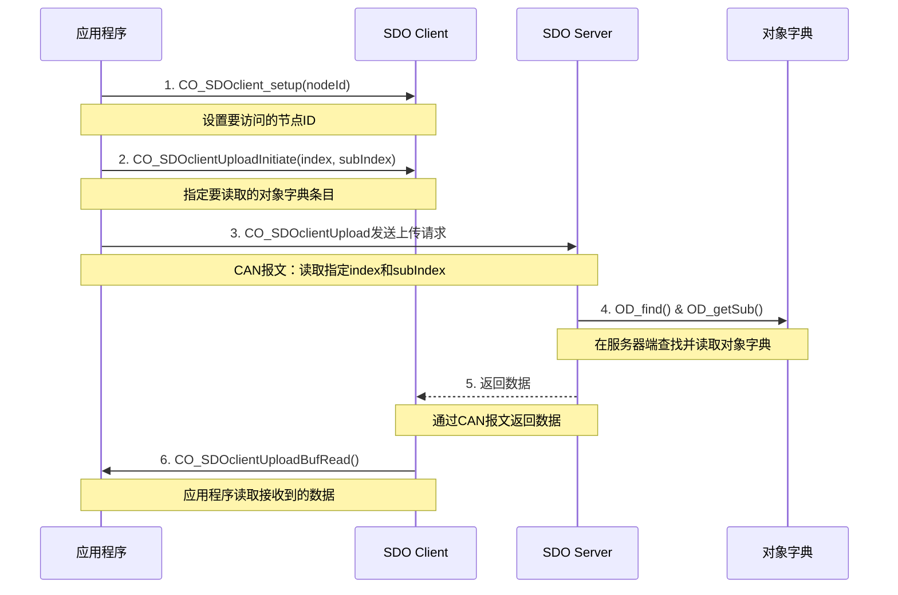
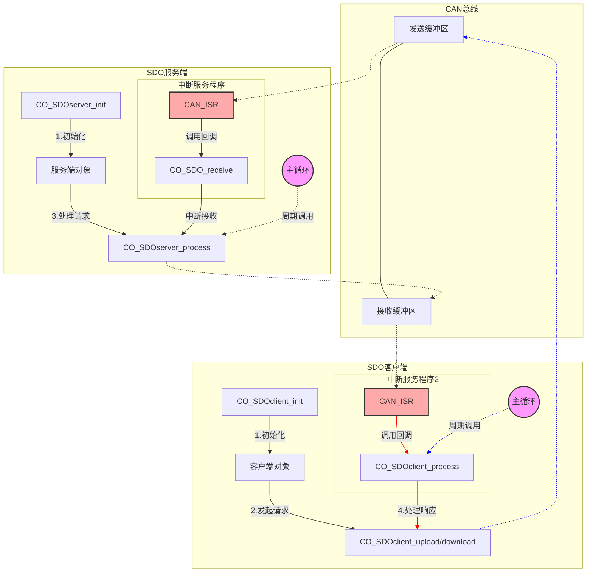
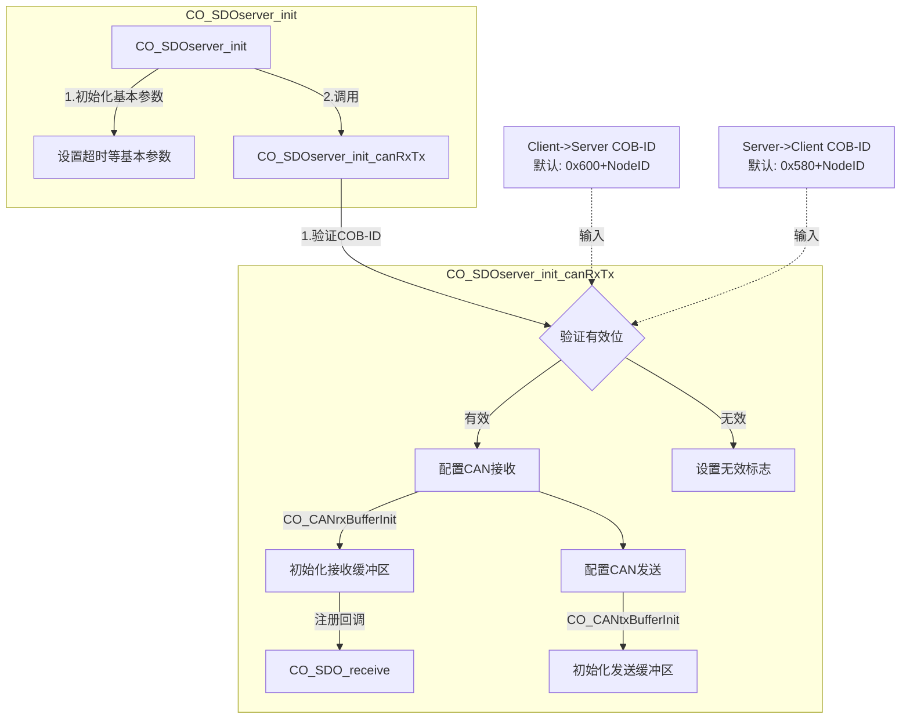
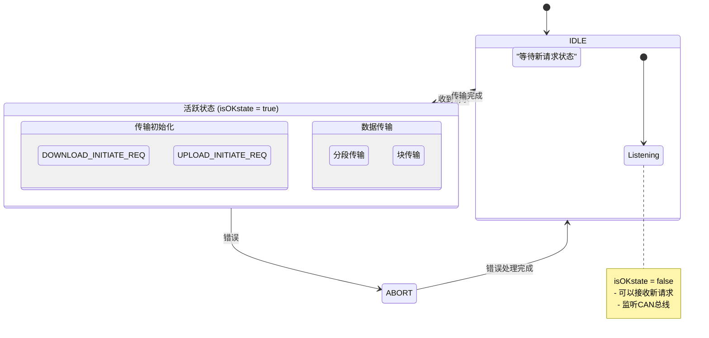
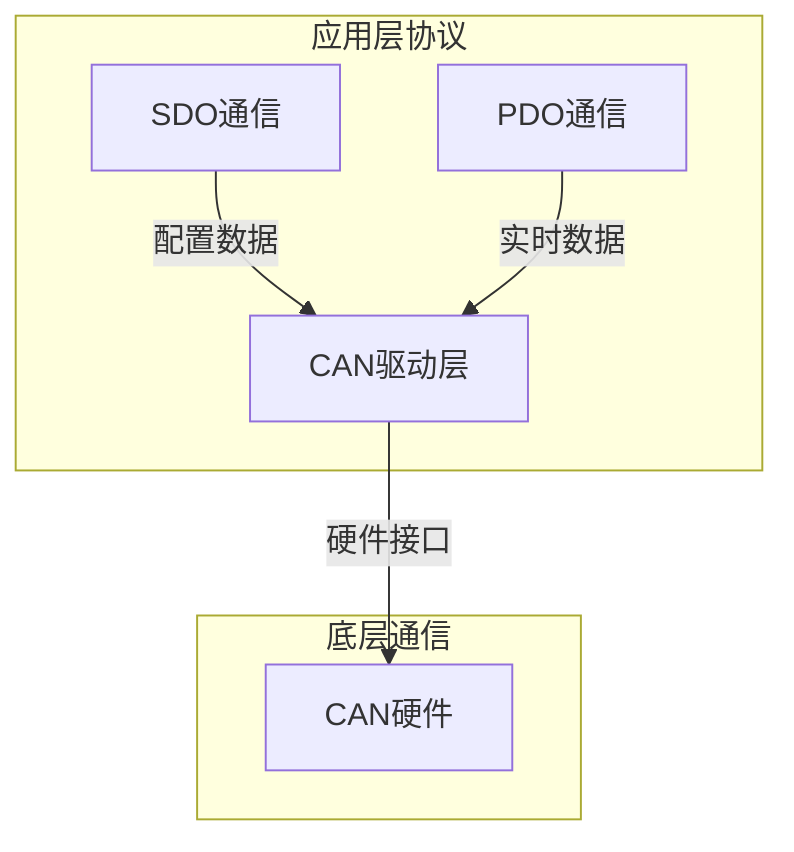
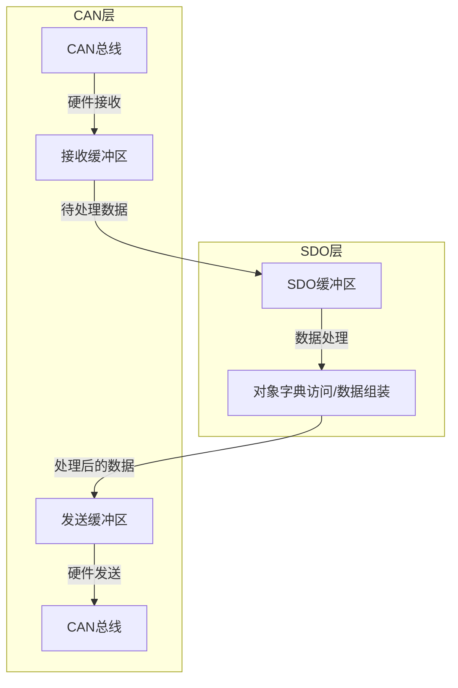

# CANopen SDO通信详解

## SDO通信概述

SDO(Service Data Object)是CANopen中用于配置和参数访问的通信机制。它采用客户端-服务端模式,通过对象字典(OD)进行数据交换。

### 基本通信流程

在`tutorial`中执行过`cocomm "read 4 0x1234 ...."`的命令。
实际上他执行的就是上述过程。

读取时由SDO 客户端发起请求。

## SDO通信实现细节

### 通信架构

### SDO服务端初始化
SDO服务端通过`CO_SDOserver_init`函数完成初始化,主要包括基本参数配置和CAN通信通道的建立。

### SDO请求处理
`CO_SDOserver_process`其实就是一个分发器

#### SDO状态说明
IDLE状态(Inactive, Disconnected, Listening and Enabled)包含以下含义:

- **Inactive**: 不活跃状态,等待新请求
- **Disconnected**: 未建立连接
- **Listening**: 持续监听总线
- **Enabled**: 服务已启用并准备就绪

## CAN层

那`CO_CANsend`和`CO_CANread`在什么地方？他们俩是CAN层收发的接口

### 数据流向
